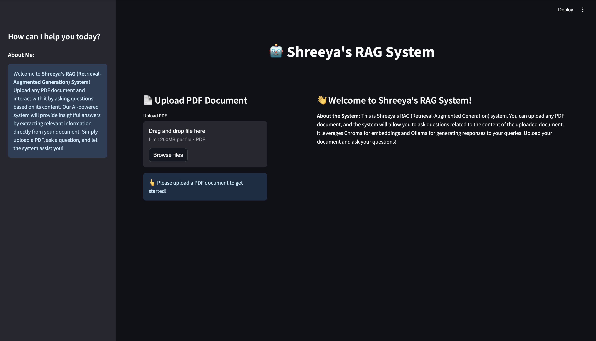
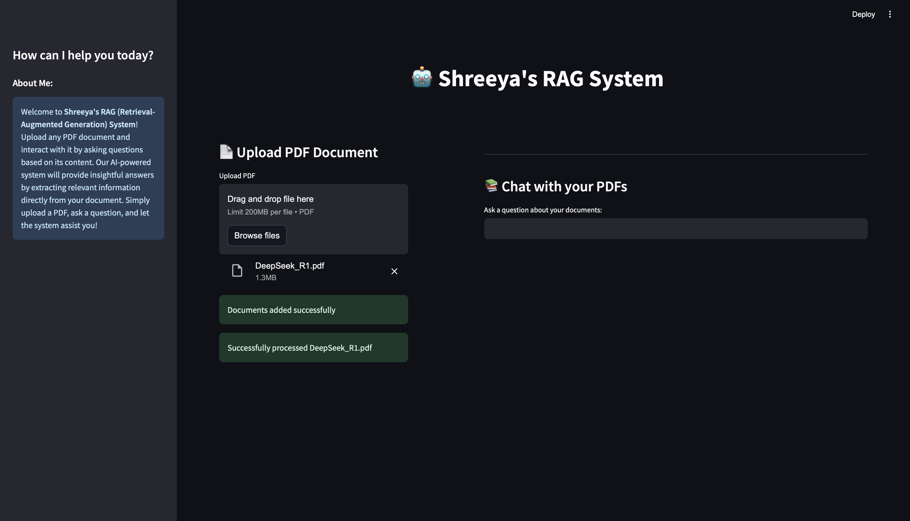
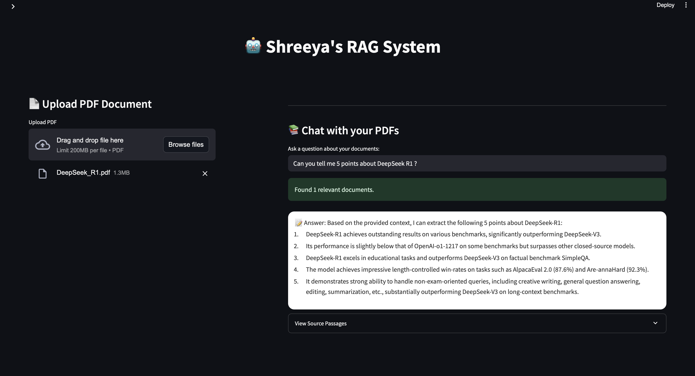
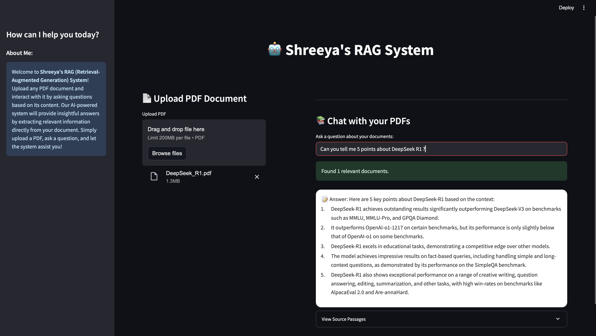

# 📚 Shreeya's RAG System

**Shreeya's RAG System** is a user-friendly, AI-powered web application built with **Streamlit**, enabling users to upload PDF documents and ask questions based on the document content. It combines **ChromaDB** for semantic search with **Ollama's Llama 3.2** for generating natural, context-aware answers.

---

## 🚀 Features

- 📄 **PDF Upload** – Seamlessly upload any PDF document.
- 🧠 **RAG-Powered Search** – Uses Retrieval-Augmented Generation to fetch and respond with context-relevant answers.
- 🔍 **Chunk-Based Indexing** – Smart chunking of content with overlaps for better comprehension.
- 💬 **Interactive QA Chat** – Ask natural questions and receive AI-generated answers in a chat-friendly layout.
- 🧩 **Embeddings with Chroma** – Uses Chroma's default embedding function for document vectorization.
- 🤖 **LLM via Ollama** – Runs locally using the Llama 3.2 model via Ollama.

---

## 🛠️ Tech Stack

- **Frontend**: [Streamlit](https://streamlit.io/)
- **Backend**: [ChromaDB](https://www.trychroma.com/), [Ollama](https://ollama.com/)
- **Language**: Python
- **Embedding Model**: Chroma Default
- **LLM**: Llama 3.2 via Ollama API
- **File Support**: PDF

---

## 🧪 How It Works

1. **Upload a PDF** using the interface.
2. The system:
   - Extracts the text.
   - Breaks it into manageable overlapping chunks.
   - Stores them with embeddings in a persistent ChromaDB collection.
3. Ask a **natural language question**.
4. The system:
   - Retrieves the top relevant chunks.
   - Sends the context to **Ollama’s Llama 3.2**.
   - Returns an accurate, context-aware answer.

---

## 💻 Running Locally

### 1.Clone the repository

```bash
git clone https://github.com/ShreeyaAsawa/llm-rag-learning.git
cd llm-rag-learning
```
2.Install Dependencies
Ensure Python 3.8+ is installed. Then run:
```bash
pip install -r requirements.txt
```
3. Start Ollama with Llama 3.2
Ensure you have Ollama installed and running:
```bash
ollama run llama3.2
```
4. Launch the App
```bash
streamlit run rag_pdf_simple.py
```
This will open the application in your default browser.
Upload a PDF file, ask a question in natural language, and the app will generate an answer based on the content of the document.

🖼️ Screenshots

📌 User Interface
<p align="center">  </p>
📌 Uploading a PDF
<p align="center">  </p>
📌 Example Questions from DeepSeek-R1 PDF
<p align="center">  </p> 
📌 Overall UI
<p align="center">  </p> 


